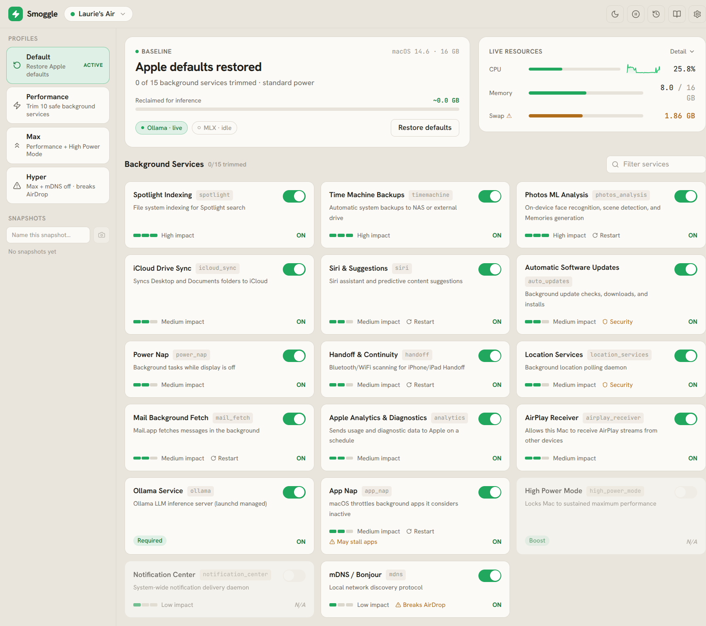
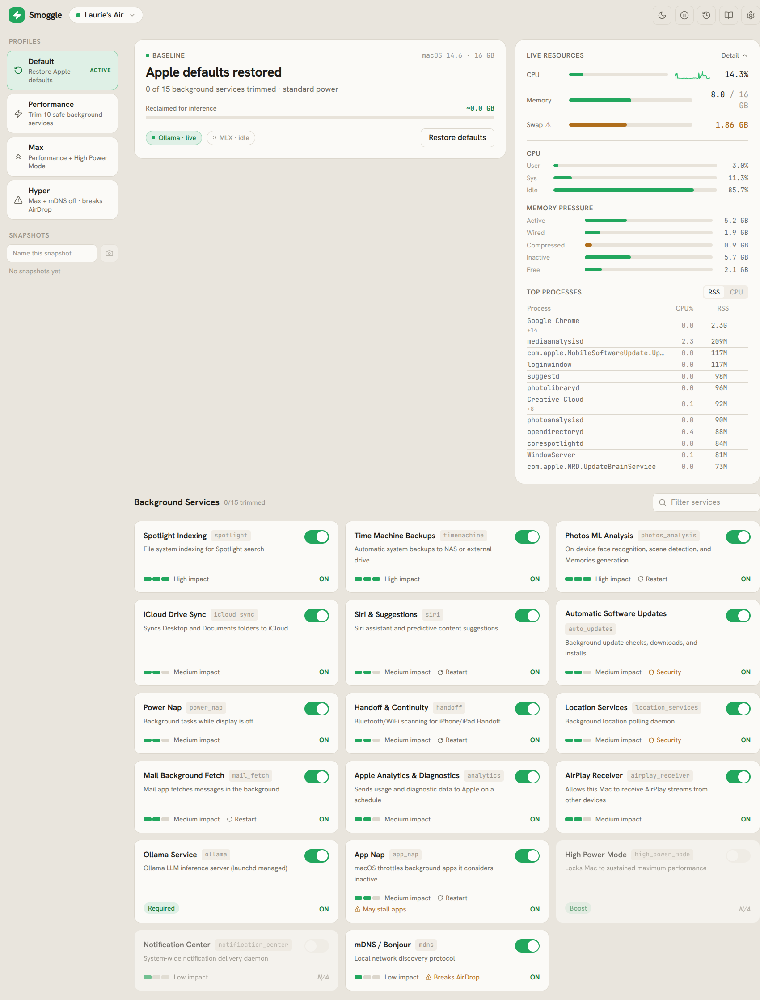
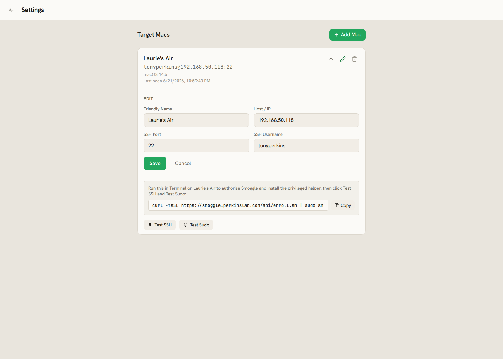
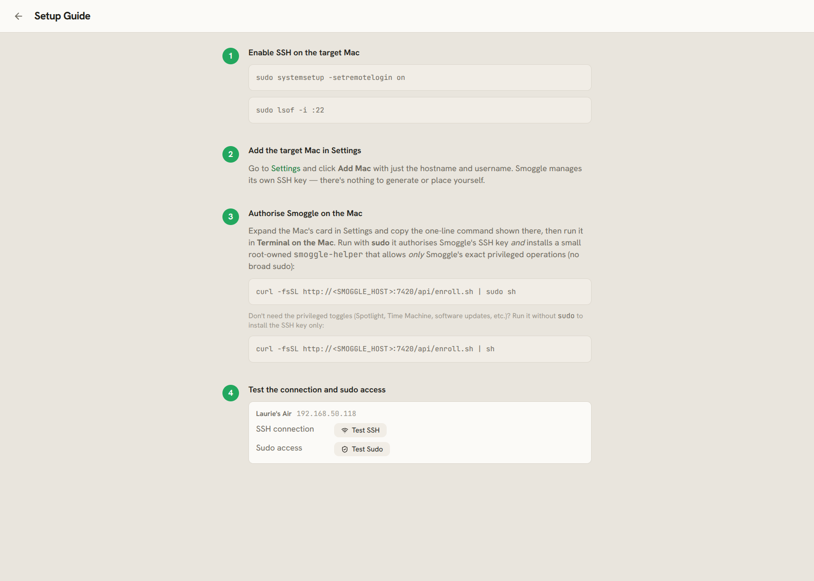
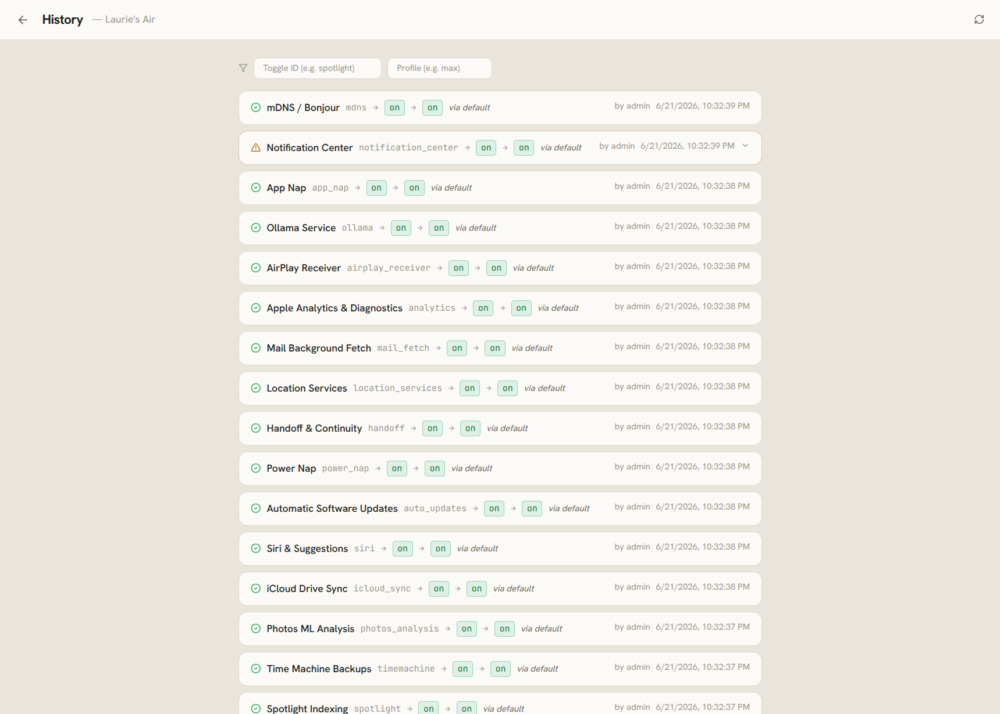
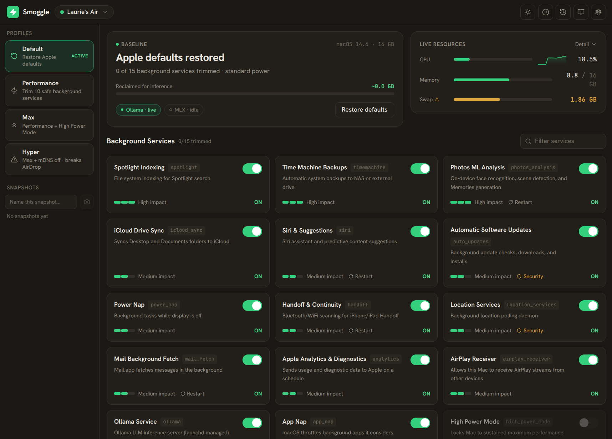

# Smoggle

AI Performance Toggle Dashboard for macOS Apple Silicon.

Remotely toggle macOS system services via SSH to maximize MLX/Ollama inference performance. Runs on a Linux/Docker host and controls target Macs over SSH.

---

## Background

Smoggle started on an **M4 MacBook Air with 16 GB of unified memory** — my wife's
laptop — which I'd borrowed to experiment with running local models (MLX / Ollama).

On a machine with limited unified memory, inference is sensitive to whatever else
is competing for CPU, GPU, the Neural Engine, and memory bandwidth. macOS quietly
runs a lot of background work — Spotlight indexing, Photos ML analysis, Time
Machine, iCloud sync, software-update downloads, and more — that spins up and down
at unpredictable times and noticeably affects performance.

I wanted two things:

1. an easy way to **turn that background work off** before a session to free up
   resources, and
2. an equally easy way to **put everything back to normal** afterward — because,
   again, it's my wife's MacBook 🙂

That's why Smoggle is built around **profiles** (apply a performance preset in one
click) and **snapshots** (capture the current state, then restore it later — and
the *Default* profile resets every toggle to its macOS default). Maximize
performance when you want it; leave no trace when you're done.

---

## Supported platforms

- **Apple Silicon Macs only** (no Intel support).
- **Tested on macOS 14 (Sonoma).** Toggles drive macOS via system commands whose
  behaviour can change between releases, so Smoggle is only verified against the
  version above. Other macOS versions are **best-effort**: the dashboard detects
  each target's macOS version and shows a warning when it's outside the tested
  range, since a toggle may apply or report its state incorrectly there.

The Smoggle server itself runs on any Linux/Docker host (it talks to the Macs
over SSH).

---

## Quick Start

### 1. Clone

```bash
git clone <repo> smoggle
cd smoggle
```

### 2. Build and run

```bash
docker compose up -d --build
```

Smoggle runs on port **7420**. Health check: `curl http://localhost:7420/health`

### 3. Sign in

The dashboard is protected by HTTP Basic Auth. On first boot Smoggle generates a
random admin password and prints it **once** to the container log:

```bash
docker compose logs smoggle | grep -A4 "admin password"
```

Default username is `admin`. To set your own credentials, provide
`SMOGGLE_AUTH_USER` and a bcrypt `SMOGGLE_AUTH_PASSWORD_HASH` and restart — see
[SECURITY.md](SECURITY.md).

### 4. Add a target Mac

First enable Remote Login (SSH) on the Mac:

```bash
sudo systemsetup -setremotelogin on
```

Then in **Settings → Add Mac**, enter the Mac's hostname/IP and SSH username.
Smoggle manages its own SSH key — there is nothing to generate or copy yourself.

### 5. Enroll the Mac

Expand the Mac's card (or open the **Setup Guide**) and copy the one-line
command, then run it in **Terminal on the Mac**:

```bash
# Recommended — authorises Smoggle's SSH key AND installs a root-owned
# allowlist (smoggle-helper) for its exact privileged operations. No broad sudo.
curl -fsSL http://<SMOGGLE_HOST>:7420/api/enroll.sh | sudo sh

# Key only (user-level toggles work; privileged ones disabled) — omit sudo:
curl -fsSL http://<SMOGGLE_HOST>:7420/api/enroll.sh | sh
```

Then click **Test SSH** and **Test Sudo** on the card to confirm.

### 6. Use the dashboard

Return to the Dashboard — toggle cards load with live state.

### 7. TLS / remote access (optional)

Smoggle is intended for a **private network**. To reach it remotely, front it
with a reverse proxy that terminates TLS (or use a Tailscale/WireGuard tailnet):

```
smoggle.yourdomain.com {
    reverse_proxy smoggle:7420
}
```

Dashboard auth is handled by the app itself (no proxy auth needed). See
[SECURITY.md](SECURITY.md) for the threat model and deployment guidance.

---

## Screenshots

### Dashboard


### System Resources


### Target Mac Settings


### Setup Guide


### History


### Dark Mode


---

## Development (without Docker)

### Backend

```bash
cd smoggle
python -m venv .venv
source .venv/bin/activate
pip install -r backend/requirements.txt
PYTHONPATH=. uvicorn backend.main:app --reload --port 7420
```

### Frontend

```bash
cd frontend
npm install
npm run dev   # http://localhost:5173 — proxies /api to :7420
```

---

## Architecture

```
[Browser / Phone]
      |
      ▼
[Caddy on Docker host] ──► smoggle.yourdomain.com
      |
      ▼
[Smoggle FastAPI :7420]
      |
      ├──► SSH ──► Mac 1 (<IP>)
      └──► SSH ──► Mac 2 (<IP>)
```

- **Backend**: FastAPI + SQLModel (SQLite) + Paramiko SSH
- **Frontend**: React 18 + Vite + Tailwind CSS
- **SSE**: Resource monitor pushed every 3s — no polling
- **Auth**: HTTP Basic Auth on all API routes; SSH host-key pinning; privileged
  Mac operations confined to a root-owned allowlist. Intended for a private
  network — see [SECURITY.md](SECURITY.md).

---

## Toggle Profiles

| Profile | Color | Toggles | Confirmation |
|---|---|---|---|
| 🔄 Default | Slate | Restore all Apple defaults | None |
| ⚡ Performance | Blue | 10 safe toggles | None |
| 🚀 Max | Purple | Performance + 5 more | Single dialog |
| ☢️ Hyper | Red | Max + mDNS + Notifications | Type `HYPER` |

---

## Notes

- Apple Silicon only — no Intel Mac support
- No localStorage — all state in SQLite
- Security model and deployment guidance: [SECURITY.md](SECURITY.md)
- Local mode stubbed — `LocalExecutor` raises `NotImplementedError`
